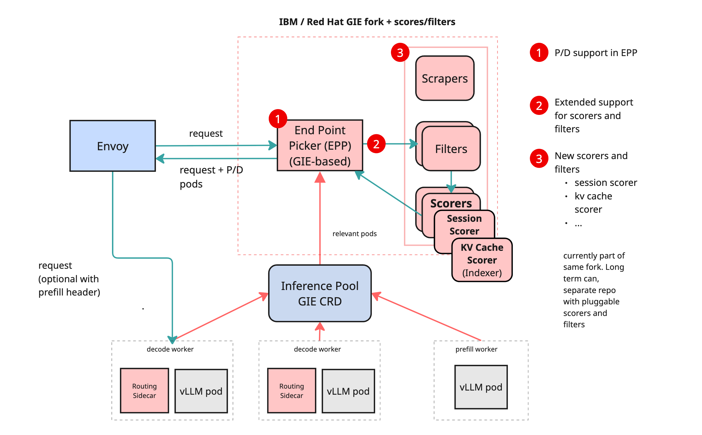
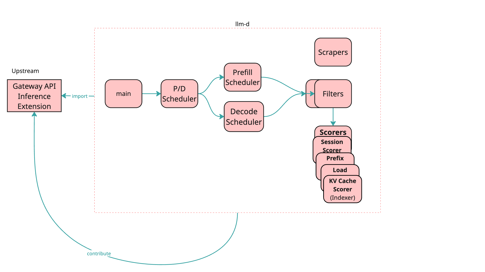

# llm-d Inference Router Architecture

## Overview

**llm-d** is an extensible architecture designed to route inference requests efficiently across model-serving pods. A central component of this architecture is the **Inference Gateway**, which builds on the Kubernetes-native **Gateway API Inference Extension (GIE)** to enable scalable, flexible, and pluggable routing of requests.

The design enables:

- Support for **multiple base models** and **LoRA adapters** within a shared cluster [Not supported in Phase1]
- Efficient routing based on **KV cache locality**, **prefix**, **session affinity**, **load**, and **model metadata**
- Disaggregated **Prefill/Decode (P/D)** execution
- Pluggable **filters**, **scorers**, and **scrapers** for extensible routing

---

## Core Goals

- Route inference requests to optimal pods based on:
  - Base model compatibility
  - KV cache reuse
  - Load balancing
- Support multi-model deployments on heterogeneous hardware
- Enable runtime extensibility with pluggable logic (filters, scorers, scrapers)
- Community-aligned implementation using GIE and Envoy + External Processing (EPP)

---

## Architecture Design



The inference scheduler is built on top of:

- **Envoy** as a programmable data plane
- **EPP (External Processing Plugin)** using **GIE**

### Pluggability



Routing decisions are governed by dynamic components:

- **Filters**: Exclude pods based on static or dynamic criteria
- **Scorers**: Assign scores to candidate pods
- **Scrapers**: Collect pod metadata and metrics for scorers

These components are maintained in the `llm-d-inference-scheduler` repository and can evolve independently.

---

## Filters, Scorers, and Scrapers

### Core Design Principles

- **Pluggability**: No core changes are needed to add new scorers or filters
- **Isolation**: Each component operates independently

### Routing Flow

1. **Filtering**
   - Pods in an `InferencePool` go through a sequential chain of filters
   - Pods may be excluded based on criteria like model compatibility, resource usage, or custom logic

2. **Scoring**
   - Filtered pods are scored using a weighted set of scorers
   - Scorers currently run sequentially (future: parallel execution)
   - Scorers access a shared datastore populated by scrapers

3. **Pod Selection**
   - The highest-scored pod is selected
   - If multiple pods share the same score, one is selected at random

### Lifecycle Hooks

- `Pre-call`
- `Scoring`
- `Post-choice`
- `After-response`

---

## Scorers & Configuration

| Scorer           | Description                                | Env Vars |
|------------------|--------------------------------------------|----------|
| Session-aware    | Prefers pods from same session             | `ENABLE_SESSION_AWARE_SCORER`, `SESSION_AWARE_SCORER_WEIGHT`, `PREFILL_ENABLE_SESSION_AWARE_SCORER`, `PREFILL_SESSION_AWARE_SCORER_WEIGHT` |
| Prefix-aware     | Scores based on prompt prefix history;<br>lightweight but may not reflect actual KV-cache state | `ENABLE_PREFIX_AWARE_SCORER`, `PREFIX_AWARE_SCORER_WEIGHT`, `PREFILL_ENABLE_PREFIX_AWARE_SCORER`, `PREFILL_PREFIX_AWARE_SCORER_WEIGHT`, `PREFIX_CACHE_HASH_BLOCK_SIZE`, `PREFIX_CACHE_LRU_CAPACITY_PER_SERVER`, `PREFIX_CACHE_MAX_PREFIX_BLOCKS`|
| KVCache-aware    | Scores based on real KV-cache state on vLLM;<br>more accurate but requires extra computation and cycles to track the current cache state | `ENABLE_KVCACHE_AWARE_SCORER`, `KVCACHE_INDEXER_REDIS_ADDR`, `PREFILL_ENABLE_KVCACHE_AWARE_SCORER`, `PREFILL_KVCACHE_INDEXER_REDIS_ADDR`, `HF_TOKEN`, `KVCACHE_INDEXER_REDIS_ADDR` |
| Load-aware       | Avoids busy pods                           | `ENABLE_LOAD_AWARE_SCORER`, `LOAD_AWARE_SCORER_WEIGHT`, `PREFILL_ENABLE_LOAD_AWARE_SCORER`, `PREFILL_LOAD_AWARE_SCORER_WEIGHT` |

### Prefill / Decode Configuration

In case Disaggrigated Prefill is enabled, you should also define the following environment variables.

- Toggle P/D mode: `PD_ENABLED=true`
- Threshold: `PD_PROMPT_LEN_THRESHOLD=<value>`

### Prefix Aware Scorer Configuration

- `PREFIX_CACHE_LRU_CAPACITY_PER_SERVER` - the cache capacity sets the maximum number of blocks the LRU cache can store per pod. A block maps from a chunk of a prompt to a set of pods that are estimated to have the prefix of the prompt that ends at the keyed chunk.
- `PREFIX_CACHE_HASH_BLOCK_SIZE` - the cache block size defines the length of the prompt chunk that a block is keyed by.
- `PREFIX_CACHE_MAX_PREFIX_BLOCKS`- The maximum number of blocks to find prefix match. The default is 128 (or 256*64=16384 characters, or roughly 4096 tokens). This is useful to tradeoff prefix match accuracy for performance.

#### Prefill Scorers

```bash
export PREFILL_ENABLE_SESSION_AWARE_SCORER=true
export PREFILL_SESSION_AWARE_SCORER_WEIGHT=1
export PREFILL_ENABLE_KVCACHE_AWARE_SCORER=true
export PREFILL_KVCACHE_AWARE_SCORER_WEIGHT=1
export PREFILL_ENABLE_LOAD_AWARE_SCORER=true
export PREFILL_LOAD_AWARE_SCORER_WEIGHT=1
export PREFILL_ENABLE_PREFIX_AWARE_SCORER=true
export PREFILL_PREFIX_AWARE_SCORER_WEIGHT=1
```

---

## Metric Scraping

- Scrapers collect metrics (e.g., memory usage, active adapters)
- Data is injected into the shared datastore for scorers
- Scoring can rely on numerical metrics or metadata (model ID, adapter tags)

---

## Disaggregated Prefill/Decode (P/D)

When enabled, the router:

- Selects one pod for **Prefill** (prompt processing)
- Selects another pod for **Decode** (token generation)

The **vLLM sidecar** handles orchestration between Prefill and Decode stages. It allows:

- Queuing
- Local memory management
- Experimental protocol compatibility

> **Note**: The detailed P/D design is available in this document: [Disaggregated Prefill/Decode in llm-d](./dp.md)
---

## InferencePool & InferenceModel Design

### Current Assumptions

- Single `InferencePool` and single `EPP` due to Envoy limitations
- Model-based filtering can be handled within EPP
- Currently only one base model is supported

---

## References

- [GIE Spec](https://gateway-api-inference-extension.sigs.k8s.io/)
- [Envoy External Processing](https://www.envoyproxy.io/docs/envoy/latest/configuration/http/http_filters/ext_proc_filter)
