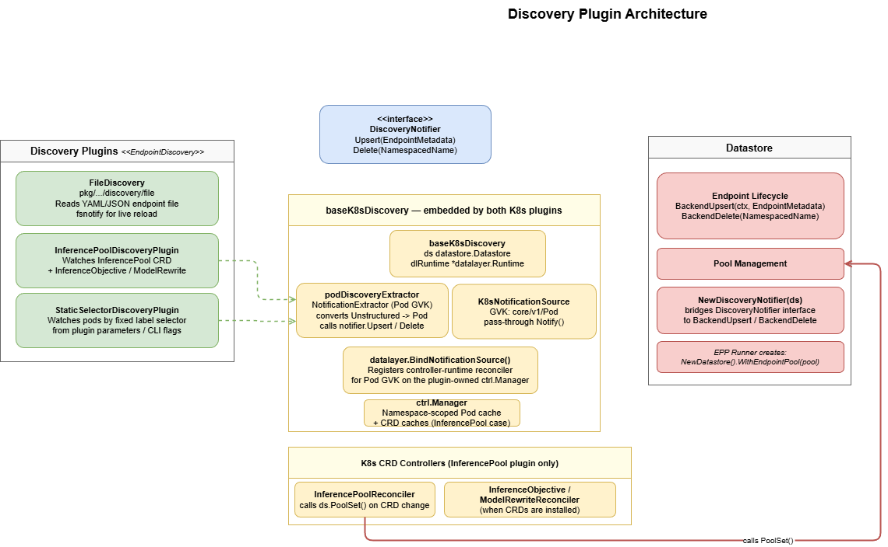

# Discovery Plugin Architecture

## Overview

The EPP discovers inference endpoints through an **EndpointDiscovery** plugin -- a
pluggable abstraction that populates and maintains the endpoint datastore independently
of the underlying infrastructure. By default the EPP uses Kubernetes CRD reconcilers
to discover endpoints. When an `EndpointDiscovery` plugin is configured, the plugin
becomes the sole source of truth for endpoint lifecycle.

This enables the EPP to run without a Kubernetes cluster, which is valuable for RL
training and inference workloads on Slurm, Ray, and other non-Kubernetes infrastructure.



---

## Core Interfaces

All discovery interfaces live in `pkg/epp/framework/interface/datalayer/discovery.go`,
co-located with the other datalayer interfaces.

### `EndpointDiscovery`

```go
type EndpointDiscovery interface {
    fwkplugin.Plugin
    Start(ctx context.Context, notifier DiscoveryNotifier) error
}
```

`Start` is the plugin's entry point. It blocks in the caller's goroutine until
`ctx` is cancelled or a fatal error occurs. The caller (the runner's errgroup) is
responsible for starting it in a dedicated goroutine.

Implementations SHOULD enumerate all currently known endpoints via
`notifier.Upsert` before entering the watch loop, to avoid serving an empty
datastore at startup. Implementations that guarantee no missed events through their
watch mechanism (e.g. a Kubernetes list+watch) may fold the initial enumeration into
the watch sequence instead.

### `DiscoveryNotifier`

```go
type DiscoveryNotifier interface {
    Upsert(endpoint *EndpointMetadata)
    Delete(id types.NamespacedName)
}
```

The callback through which the plugin drives the datastore.

**Not goroutine-safe.** All calls must be made sequentially from a single goroutine.

**Ordering contract:** Upsert and Delete calls are processed in the order received.
An Upsert followed by a Delete for the same endpoint must arrive in that order, or
the endpoint will be incorrectly left in the datastore.

---

## Integration with the Datalayer

Discovery is intentionally placed under the datalayer component because:

- The datalayer already contains K8s binding code (`k8s_bind.go`) and push-based
  metrics mechanisms. Discovery is a natural peer.
- Both K8s discovery plugins use `datalayer.BindNotificationSource` with a shared
  `podDiscoveryExtractor` (defined in `pod_extractor.go` in the `k8s` plugin package)
  to translate pod lifecycle events into `DiscoveryNotifier` calls, eliminating
  duplicated controller-runtime wiring.
- When a K8s discovery plugin is configured, `dlRuntime.Start(ctx, mgr)` is called
  on the manager the plugin owns, binding any configured notification sources
  (push-based metrics) to that manager.

---

## Plugin Registration

An `EndpointDiscovery` implementation must also satisfy `fwkplugin.Plugin` (enforced
at compile time by the interface embedding). Register via:

```go
fwkplugin.Register(MyPluginType, MyFactory)
```

Reference the plugin in the config:

```yaml
discovery:
  pluginRef: my-plugin-name
```

---

## Built-in Plugins

### `file-discovery`

**Package:** `pkg/epp/framework/plugins/datalayer/discovery/file`

Reads a YAML (or JSON) file listing inference endpoints. Optionally watches for
file changes at runtime using `fsnotify`.

When using this plugin the EPP has no dependency on Kubernetes and can run in
any environment -- bare-metal, Slurm, Ray, or a local laptop.

#### Parameters

| Parameter   | Type   | Required | Default | Description |
|-------------|--------|----------|---------|-------------|
| `path`      | string | yes      | --      | Path to the endpoints file |
| `watchFile` | bool   | no       | `false` | Reload when file changes on disk |

#### Endpoints file format

```yaml
endpoints:
  - name: vllm-0
    namespace: default       # optional, defaults to "default"
    address: 10.0.0.1
    port: "8080"
    metricsHost: 10.0.0.1:8080   # optional; derived as address:port if absent
    labels:
      model: llama-3-8b
```

#### Reload behaviour

When `watchFile: true`, on any `Write` or `Create` event:
- All endpoints in the new file are upserted (add or update).
- Endpoints absent from the new file but present in the previous load are deleted.
- All upserts are delivered before any deletes (ordering contract preserved).

### `inference-pool-discovery`

**Package:** `pkg/epp/framework/plugins/datalayer/discovery/k8s`

Discovers endpoints by watching Kubernetes pods whose labels match an `InferencePool`
CRD. Also optionally watches `InferenceObjective` and `InferenceModelRewrite` CRDs
when those are installed. Owns its own `ctrl.Manager` internally.

#### Parameters

| Parameter        | Type   | Required | Default                          | Description |
|------------------|--------|----------|----------------------------------|-------------|
| `poolName`       | string | yes*     | from `--pool-name` flag          | InferencePool name |
| `poolNamespace`  | string | no       | `"default"`                      | InferencePool namespace |
| `poolGroup`      | string | no       | `"inference.networking.k8s.io"`  | API group |
| `leaderElection` | bool   | no       | `false`                          | Enable leader election |

*When no `discovery` section is in the config, pool name comes from `--pool-name`.

### `static-selector-discovery`

**Package:** `pkg/epp/framework/plugins/datalayer/discovery/k8s`

Discovers endpoints by watching pods matching a fixed label selector from plugin
parameters. No InferencePool CRD required. Owns its own `ctrl.Manager` internally.

#### Parameters

| Parameter             | Type     | Required | Default     | Description |
|-----------------------|----------|----------|-------------|-------------|
| `endpointSelector`    | string   | yes      | --          | Pod label selector (e.g. `"app=vllm"`) |
| `endpointTargetPorts` | []int    | yes      | --          | Ports to create endpoints for |
| `namespace`           | string   | no       | `"default"` | Namespace to watch |

---

## Backward Compatibility

When no `discovery` section is present in the EPP config, the EPP falls back to
Kubernetes-based discovery based on which CLI flags are provided:

| CLI flags | Behavior |
|-----------|----------|
| `--pool-name` set (default) | Uses `inference-pool-discovery` -- watches pods matching the named `InferencePool` CRD. Requires a K8s cluster with the InferencePool CRD installed. |
| `--endpoint-selector` set | Uses `static-selector-discovery` -- watches pods matching the given label selector in K8s. No InferencePool CRD required, but still requires a K8s cluster. |
| Neither set | EPP fails to start: `--pool-name is required when no discovery plugin is configured` |

Existing deployments that rely on the `--pool-name` flag continue to work without
any config change. The `discovery` section is only needed when using a non-K8s
plugin such as `file-discovery`.

---

## Examples

### Using file-discovery

Add the following plugin entry and `discovery` section to your `EndpointPickerConfig`.
This is the same for both the non-P/D and P/D cases:

```yaml
plugins:
  - name: file-discovery
    type: file-discovery
    parameters:
      path: /etc/epp/endpoints.yaml
      watchFile: true

discovery:
  pluginRef: file-discovery
```

See the [Appendix](#appendix----envoy-config) for the Envoy config, which is
identical for both setups.

#### Without P/D disaggregation

Running components:

| Component | Port |
|-----------|------|
| vLLM (or sim) | 8000 |
| EPP | 9002 (gRPC), 9003 (health), 9090 (metrics) |
| Envoy | 8081 |

Endpoints file:

```yaml
endpoints:
  - name: vllm-0
    address: 10.0.0.1
    port: "8000"
    labels:
      model: Qwen/Qwen2.5-1.5B-Instruct
  - name: vllm-1
    address: 10.0.0.2
    port: "8000"
    labels:
      model: Qwen/Qwen2.5-1.5B-Instruct
```

#### With P/D disaggregation

Each request is handled in two stages: the EPP selects a decode worker
(`x-gateway-destination-endpoint`) and a prefill worker (`x-prefiller-host-port`).
The sidecar on the decode worker reads the prefill header, issues the prefill
request, then runs decode locally.

Running components:

| Component | Port |
|-----------|------|
| prefill worker | 8000 |
| decode worker | 8001 |
| sidecar (fronts decode) | 8002 |
| EPP | 9002 (gRPC), 9003 (health), 9090 (metrics) |
| Envoy | 8081 |

In addition to the common `file-discovery` plugin, add the disagg plugins and
replace `schedulingProfiles` in your `EndpointPickerConfig`:

```yaml
plugins:
  # ... file-discovery plugin from above, plus:
  - type: disagg-headers-handler
  - type: decode-filter
  - type: prefill-filter
  - type: always-disagg-pd-decider
  - type: disagg-profile-handler
    parameters:
      deciders:
        prefill: always-disagg-pd-decider

schedulingProfiles:
  - name: decode
    plugins:
      - pluginRef: decode-filter
      - pluginRef: random-picker
  - name: prefill
    plugins:
      - pluginRef: prefill-filter
      - pluginRef: random-picker
```

Endpoint roles are declared via the `llm-d.ai/role` label. The decode endpoint
points at the sidecar port (8002), which fronts the vLLM decode worker.

Endpoints file:

```yaml
endpoints:
  - name: prefill-0
    address: 10.0.0.1
    port: "8000"
    labels:
      model: Qwen/Qwen2.5-1.5B-Instruct
      llm-d.ai/role: prefill
  - name: decode-0
    address: 10.0.0.2
    port: "8002"
    labels:
      model: Qwen/Qwen2.5-1.5B-Instruct
      llm-d.ai/role: decode
```

---

## Appendix -- Envoy config

Both examples use the same Envoy config. Envoy listens on port 8081, calls the
EPP via ext_proc, and routes all traffic via `ORIGINAL_DST` using the
`x-gateway-destination-endpoint` header the EPP sets.

```yaml
static_resources:
  listeners:
    - name: inference
      address:
        socket_address: { address: 0.0.0.0, port_value: 8081 }
      filter_chains:
        - filters:
            - name: envoy.filters.network.http_connection_manager
              typed_config:
                "@type": type.googleapis.com/envoy.extensions.filters.network.http_connection_manager.v3.HttpConnectionManager
                stat_prefix: inference
                route_config:
                  virtual_hosts:
                    - name: inference
                      domains: ["*"]
                      routes:
                        - match: { prefix: "/" }
                          route:
                            cluster: original_destination_cluster
                            timeout: 86400s
                http_filters:
                  - name: envoy.filters.http.ext_proc
                    typed_config:
                      "@type": type.googleapis.com/envoy.extensions.filters.http.ext_proc.v3.ExternalProcessor
                      grpc_service:
                        envoy_grpc:
                          cluster_name: ext_proc
                          authority: <epp-host>:9002
                        timeout: 10s
                      processing_mode:
                        request_header_mode: SEND
                        response_header_mode: SEND
                        request_body_mode: FULL_DUPLEX_STREAMED
                        response_body_mode: FULL_DUPLEX_STREAMED
                        request_trailer_mode: SEND
                        response_trailer_mode: SEND
                      message_timeout: 1000s
                  - name: envoy.filters.http.router
                    typed_config:
                      "@type": type.googleapis.com/envoy.extensions.filters.http.router.v3.Router
  clusters:
    - name: original_destination_cluster
      type: ORIGINAL_DST
      connect_timeout: 1000s
      lb_policy: CLUSTER_PROVIDED
      original_dst_lb_config:
        use_http_header: true
        http_header_name: x-gateway-destination-endpoint
    - name: ext_proc
      type: STRICT_DNS
      connect_timeout: 10s
      lb_policy: LEAST_REQUEST
      typed_extension_protocol_options:
        envoy.extensions.upstreams.http.v3.HttpProtocolOptions:
          "@type": type.googleapis.com/envoy.extensions.upstreams.http.v3.HttpProtocolOptions
          explicit_http_config:
            http2_protocol_options: {}
      load_assignment:
        cluster_name: ext_proc
        endpoints:
          - lb_endpoints:
              - endpoint:
                  address:
                    socket_address:
                      address: <epp-host>   # docker-compose service name or IP
                      port_value: 9002
```
