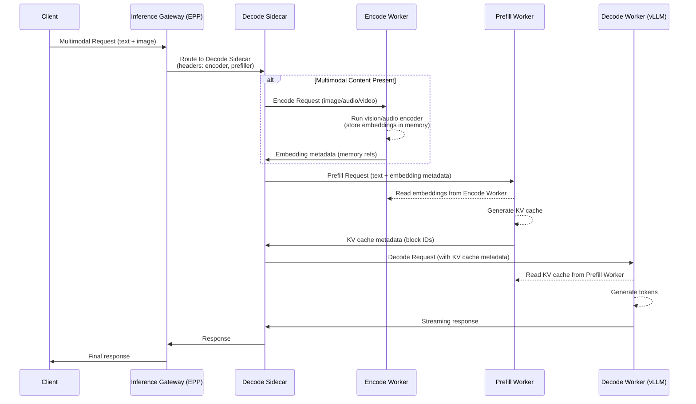
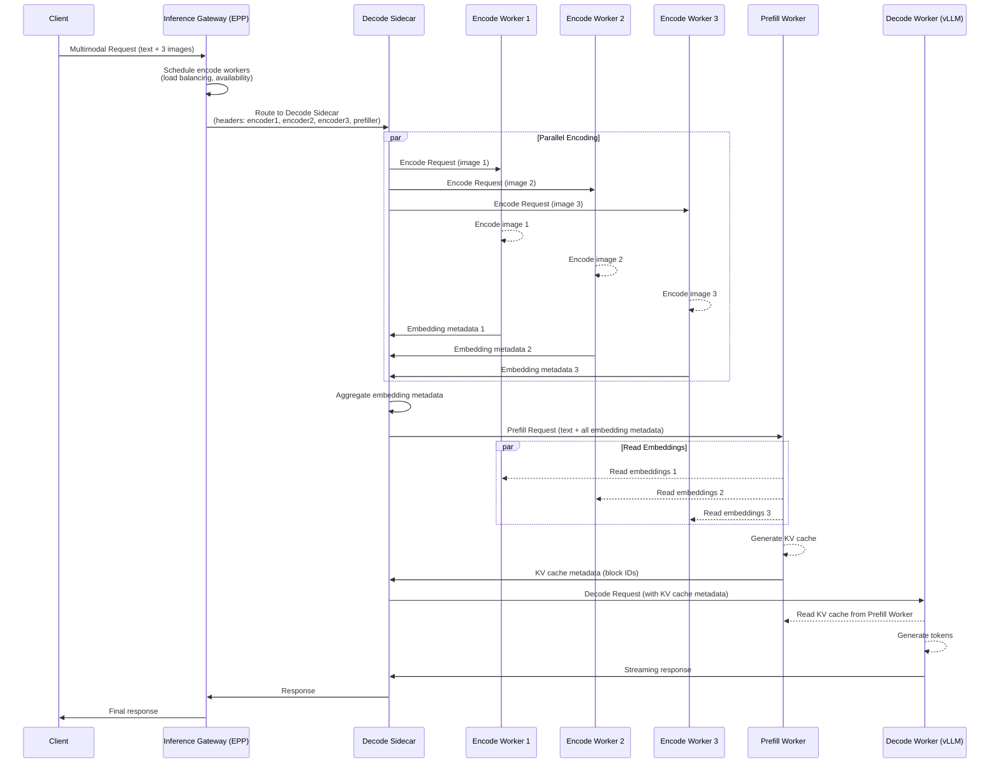

# Proposal: E/P/D (Encode/Prefill/Decode) Disaggregation Support in llm-d

## Motivation

### Current State: P/D Disaggregation
llm-d currently supports **Prefill/Decode (P/D) disaggregation**, which separates:
- **Prefill**: Processing the input prompt to generate KV cache
- **Decode**: Auto-regressive token generation using the cached KV

This architecture improves resource utilization by allowing specialized hardware for each stage (e.g., high-memory pods for prefill, high-compute pods for decode).

### The Need for E/P/D Disaggregation

Modern LLM workloads increasingly involve **multimodal inputs** (images, audio, video) that require:
1. **Encoding**: Converting non-text modalities into embeddings
2. **Prefill**: Processing text tokens and encoded embeddings to build KV cache
3. **Decode**: Generating output tokens

**Key Challenges with Current P/D Architecture:**

1. **Heterogeneous Hardware Requirements**
   - **Encoding** (vision/audio models): Requires specialized accelerators (e.g., NVIDIA GPUs with Tensor Cores for vision transformers)
   - **Prefill**: Memory-intensive, benefits from high-bandwidth memory
   - **Decode**: Compute-intensive, optimized for low-latency token generation

2. **Resource Inefficiency**
   - Multimodal models (e.g., LLaVA, Qwen-VL, GPT-4V) waste resources when encoding runs on the same pod as text processing
   - Vision encoders (CLIP, SigLIP) have different scaling characteristics than LLM backbones

3. **Scalability Bottlenecks**
   - Image/video encoding can be 10-100x slower than text tokenization
   - Batching efficiency differs significantly across stages
   - Current P/D disaggregation cannot isolate encoding overhead

4. **Industry Alignment**
   - **vLLM** is actively developing E/P/D support (see vLLM RFC and experimental branches)
   - **NVIDIA NIM** (Dynamo) supports multimodal disaggregation patterns
   - **Ray Serve** and other frameworks are moving toward finer-grained stage separation

### Benefits of E/P/D Disaggregation

1. **Optimized Resource Allocation**
   - Deploy vision encoders on GPU-rich nodes
   - Use CPU/edge devices for lightweight encoding tasks
   - Scale each stage independently based on workload

2. **Improved Throughput**
   - Parallel encoding of multiple images while prefill/decode continues
   - Better batching strategies per stage
   - Reduced head-of-line blocking

3. **Cost Efficiency**
   - Right-size hardware for each stage (e.g., cheaper GPUs for encoding)
   - Reduce idle time on expensive decode accelerators

4. **Flexibility**
   - Support multiple encoder types (vision, audio, video) without coupling to LLM pods
   - Enable encoder model updates without redeploying LLM workers

---

## High-Level Design

### Architecture Overview

```
┌─────────────────────────────────────────────────────────────────┐
│                         Client Request                           │
│                    (Text + Image/Audio/Video)                    │
└────────────────────────────┬────────────────────────────────────┘
                             │
                             ▼
                    ┌────────────────┐
                    │  Envoy Proxy   │
                    └────────┬───────┘
                             │
                             ▼
                    ┌────────────────┐
                    │      EPP       │◄─── Scheduling Decision
                    │  (Scheduler)   │     (Select E, P, D pods)
                    └────────┬───────┘
                             │
                ┌────────────┼────────────┐
                │            │            │
                ▼            ▼            ▼
         ┌──────────┐  ┌──────────┐  ┌──────────┐
         │  Encode  │  │ Prefill  │  │  Decode  │
         │  Worker  │  │  Worker  │  │  Worker  │
         │          │  │          │  │ +Sidecar │
         └────┬─────┘  └────┬─────┘  └────┬─────┘
              │             │             │
              │  Embedding  │  KV Cache   │
              │  Metadata   │  Metadata   │
              └─────────────┴─────────────┘
                            │
                            ▼
                    ┌────────────────┐
                    │    Response    │
                    └────────────────┘
```

### Request Flow

1. **Client Request** → Envoy with multimodal payload (text + image URLs/data)
2. **EPP Scheduling**:
   - Analyzes request (modality types, prompt length, cache hits, number of images)
   - Selects optimal pods for each stage:
     - **Encode Workers** (one or more, if multimodal content present)
       - For single image: select 1 encoder
       - For multiple images: select N encoders for parallel processing
     - **Prefill Worker** (for KV cache generation)
     - **Decode Worker** (for token generation)
   - Returns routing headers:
     - `x-encoder-host-ports`: Comma-separated list of encoder endpoints
     - `x-encoder-image-mapping`: JSON mapping of image index to encoder
     - `x-prefiller-host-port`: Prefill worker endpoint

3. **Execution Flow**:
   - Request lands on **Decode Worker Sidecar**
   - Sidecar orchestrates:
     - **Stage 1 (Encode)**: If `x-encoder-host-ports` exists:
       - **Single Image**: Send to one Encode Worker
       - **Multiple Images**: Send each image to assigned Encode Worker in parallel
       - Wait for all encoding to complete (with timeout)
       - Receive **embedding metadata** from each encoder
       - Aggregate metadata in order
     - **Stage 2 (Prefill)**: If `x-prefiller-host-port` exists:
       - Send text + aggregated embedding metadata to Prefill Worker
       - Prefill Worker reads embeddings from Encode Workers' memory (parallel reads)
       - Receive KV cache metadata
     - **Stage 3 (Decode)**:
       - Run decode locally with KV cache reference
       - Decode Worker reads KV cache from Prefill Worker's memory
       - Stream tokens back to client

4. **Response** → Decode Sidecar → Envoy → Client

### Sequence Diagram: Single Image



### Sequence Diagram: Multiple Images (Parallel Encoding)

For requests with multiple images, the EPP scheduler selects multiple encode workers and the sidecar orchestrates parallel encoding:



**Key Points for Multi-Image Encoding:**
1. **EPP Scheduling**: Selects N encode workers based on:
   - Number of images in request
   - Encoder load and availability
   - Hardware capabilities
   - Network locality

2. **Parallel Execution**: Sidecar sends encoding requests concurrently to all selected workers

3. **Metadata Aggregation**: Sidecar collects all embedding metadata and forwards as a batch to Prefill Worker

4. **Prefill Reads**: Prefill Worker reads embeddings from multiple Encode Workers in parallel (when supported by memory fabric)

5. **Failure Handling**: If one encoder fails, sidecar can:
   - Retry on another encoder
   - Fall back to sequential encoding
   - Return partial results (if model supports it)

---

## Suggested Changes

### 1. EPP Scheduler Enhancements

#### New Plugins

**a) Encode Filter (`encode-filter`)**
```yaml
- type: encode-filter
  parameters:
    label: "llm-d.ai/role"
    validValues: ["encode", "both"]
    allowsNoLabel: false
```
- Filters pods capable of running encoding workloads
- Similar to existing `prefill-filter` and `decode-filter`

**b) Multimodal Decider (`multimodal-epd-decider`)**
```yaml
- type: multimodal-epd-decider
  parameters:
    enableEncoding: true
    minImageSize: 224  # Skip encoding for tiny images
    encoderTimeout: 5000  # ms
```
- Determines if encoding stage is needed
- Checks for presence of image/audio/video in request
- Can skip encoding for cached embeddings

**c) Encode-Aware Scorer (`encode-load-scorer`)**
```yaml
- type: encode-load-scorer
  parameters:
    threshold: 10
    encoderType: "vision"  # vision, audio, video
```
- Scores encode workers based on:
  - Current encoding queue depth
  - Encoder model compatibility
  - Hardware capabilities (GPU memory, compute)

#### Modified Plugins

**PdProfileHandler → EpdProfileHandler**
```yaml
- type: epd-profile-handler
  parameters:
    encodeProfile: "encode"
    prefillProfile: "prefill"
    decodeProfile: "decode"
    deciderPluginName: "multimodal-epd-decider"
    primaryPort: 8000
```
- Extends existing P/D handler to support 3-stage routing
- Backward compatible (encode stage optional)

### 2. Scheduling Profiles

**Example Configuration:**
```yaml
apiVersion: inference.networking.x-k8s.io/v1alpha1
kind: EndpointPickerConfig
featureGates:
- prepareDataPlugins
- epdDisaggregation  # New feature gate
plugins:
  - type: encode-filter
  - type: prefill-filter
  - type: decode-filter
  - type: precise-prefix-cache-scorer
    parameters:
      tokenProcessorConfig:
        blockSize: 64
  - type: encode-load-scorer
  - type: load-aware-scorer
  - type: max-score-picker
  - type: multimodal-epd-decider
    parameters:
      enableEncoding: true
  - type: epd-profile-handler
    parameters:
      deciderPluginName: multimodal-epd-decider
      primaryPort: 8000

schedulingProfiles:
  - name: encode
    plugins:
      - pluginRef: encode-filter
      - pluginRef: max-score-picker
      - pluginRef: encode-load-scorer
        weight: 1
  - name: prefill
    plugins:
      - pluginRef: prefill-filter
      - pluginRef: max-score-picker
      - pluginRef: precise-prefix-cache-scorer
        weight: 2
  - name: decode
    plugins:
      - pluginRef: decode-filter
      - pluginRef: max-score-picker
      - pluginRef: precise-prefix-cache-scorer
        weight: 2
      - pluginRef: load-aware-scorer
        weight: 1
```

### 3. Sidecar Enhancements

**New Responsibilities:**
- Parse multimodal request payloads (OpenAI vision API format)
- Extract images/audio/video from request
- **Parallel Encoding Orchestration**:
  - Distribute images across multiple Encode Workers
  - Send encoding requests concurrently
  - Wait for all encoders to complete (with timeout)
  - Handle partial failures and retries
- Receive and aggregate **embedding metadata** from multiple encoders
- Maintain ordering of embeddings to match image positions
- Coordinate memory references between stages
- Handle encoding failures and retries

**API Extensions:**
```go
type MultimodalRequest struct {
    Text     string
    Images   []ImageInput
    Audio    []AudioInput
    Video    []VideoInput
}

type EncodingRequest struct {
    ImageIndex int        // Position in original request
    ImageData  ImageInput
    RequestID  string     // For tracking
}

type EncodingResponse struct {
    ImageIndex    int                  // Position in original request
    EmbeddingRefs []EmbeddingReference // Metadata about where embeddings are stored
    Metadata      EncodingMetadata
}

type EmbeddingReference struct {
    TensorID     string  // Unique identifier for the embedding tensor
    EncoderHost  string  // Host where embeddings are stored
    MemoryBlocks []int   // Memory block IDs on Encode Worker
    Shape        []int   // Tensor dimensions
    Dtype        string  // Data type (float16, bfloat16, etc.)
}

type AggregatedEmbeddings struct {
    Embeddings []EncodingResponse // Ordered by ImageIndex
    TotalCount int
}
```

### 4. Worker Labeling

**Encode Workers:**
```yaml
metadata:
  labels:
    llm-d.ai/role: encode
    llm-d.ai/encoder-type: vision  # or audio, video
    llm-d.ai/encoder-model: clip-vit-large
```

**Prefill Workers:**
```yaml
metadata:
  labels:
    llm-d.ai/role: prefill
```

**Decode Workers:**
```yaml
metadata:
  labels:
    llm-d.ai/role: decode
```

**Hybrid Workers (backward compatibility):**
```yaml
metadata:
  labels:
    llm-d.ai/role: both  # Can handle all stages
```

### 5. Protocol Extensions

**HTTP Headers:**
- `x-encoder-host-ports`: Comma-separated list of encoder endpoints (e.g., `10.0.1.5:8000,10.0.1.6:8000`)
- `x-encoder-image-mapping`: JSON mapping of image index to encoder (e.g., `{"0":"10.0.1.5:8000","1":"10.0.1.6:8000"}`)
- `x-encoder-model`: Encoder model identifier (e.g., `clip-vit-large-patch14`)
- `x-embedding-refs`: JSON-encoded array of embedding metadata (tensor IDs, memory blocks)
- `x-prefiller-host-port`: Prefill worker endpoint (existing)
- `x-encoding-cache-key`: Optional cache key for embedding metadata

**Request Format (OpenAI-compatible):**
```json
{
  "model": "llava-v1.6-34b",
  "messages": [
    {
      "role": "user",
      "content": [
        {"type": "text", "text": "What's in this image?"},
        {"type": "image_url", "image_url": {"url": "https://..."}}
      ]
    }
  ]
}
```

### 6. Metrics and Observability

**New Metrics:**
- `llmd_encode_requests_total`: Total encoding requests
- `llmd_encode_duration_seconds`: Encoding latency histogram
- `llmd_encode_queue_depth`: Current encoding queue size
- `llmd_encode_parallel_workers`: Number of encoders used per request
- `llmd_encode_images_per_request`: Distribution of image counts
- `llmd_epd_requests_total{stage="encode|prefill|decode"}`: Per-stage request counts
- `llmd_epd_stage_selection{decision="local|remote"}`: Stage routing decisions
- `llmd_encode_failures_total{reason="timeout|error|retry"}`: Encoding failure tracking

### 7. vLLM Integration

**Encode Worker (vLLM):**
- Run vLLM with `--enable-encoder-only` flag (when available)
- Expose encoding endpoint: `POST /v1/encode`
- Store embeddings in GPU memory
- Return **embedding metadata** (memory block IDs, tensor references)
- Support remote memory reads via RPC/RDMA

**Prefill Worker (vLLM):**
- Accept embedding metadata via `embedding_refs` parameter
- Read embeddings directly from Encode Worker's memory (zero-copy when possible)
- Process combined text + embeddings
- Return KV cache metadata

**Decode Worker (vLLM):**
- Standard decode with KV cache reference
- Read KV cache from Prefill Worker's memory
- No changes needed (handled by sidecar)

---

## Implementation Phases

### Phase 1: Foundation (Weeks 1-3)
- [ ] Implement `encode-filter` plugin
- [ ] Implement `multimodal-epd-decider` plugin
- [ ] Extend `PdProfileHandler` → `EpdProfileHandler`
- [ ] Add E/P/D scheduling profile support
- [ ] Update configuration schema

### Phase 2: Sidecar & Protocol (Weeks 4-6)
- [ ] Enhance sidecar to parse multimodal requests
- [ ] Implement encoding request/response handling
- [ ] Add HTTP header support (`x-encoder-host-port`, `x-embedding-refs`)
- [ ] Implement embedding metadata forwarding logic
- [ ] Add retry and timeout handling
- [ ] Support remote memory read coordination

### Phase 3: Worker Integration (Weeks 7-9)
- [ ] Create encode worker deployment templates
- [ ] Integrate with vLLM encoding API
- [ ] Implement embedding storage and memory management
- [ ] Test remote memory reads (RPC/RDMA)
- [ ] Test with CLIP, SigLIP encoders
- [ ] Validate embedding metadata format
- [ ] Performance benchmarking (zero-copy vs. transfer)

### Phase 4: Advanced Features (Weeks 10-12)
- [ ] Implement `encode-load-scorer`
- [ ] Add embedding metadata caching support
- [ ] Implement encoder model routing
- [ ] Add support for audio/video encoders
- [ ] Optimize memory transfer protocols
- [ ] Comprehensive E2E testing

### Phase 5: Production Readiness (Weeks 13-14)
- [ ] Documentation and examples
- [ ] Performance tuning
- [ ] Failure mode testing
- [ ] Migration guide from P/D to E/P/D
- [ ] Release and community feedback

---

## Backward Compatibility

1. **Existing P/D Deployments**: Continue to work unchanged
   - E/P/D is opt-in via feature gate
   - `PdProfileHandler` remains supported

2. **Text-Only Requests**: Automatically skip encoding stage
   - No performance impact
   - Routing falls back to P/D or single-node

3. **Hybrid Workers**: Support `llm-d.ai/role: both`
   - Can handle all stages locally
   - Useful for small deployments

---

## Testing Strategy

### Unit Tests
- Plugin logic (filters, scorers, deciders)
- Sidecar encoding request handling
- Embedding merging and validation

### Integration Tests
- E/P/D routing with mock workers
- Multimodal request parsing
- Error handling and retries

### E2E Tests
- Full E/P/D pipeline with vLLM
- LLaVA, Qwen-VL model testing
- Performance benchmarks vs. P/D
- Failure scenarios (encoder timeout, OOM)

### Performance Tests
- Latency: E/P/D vs. P/D vs. single-node
- Throughput: Requests/second with multimodal workloads
- Resource utilization: GPU/memory per stage

---

## Risks and Mitigations

| Risk | Impact | Mitigation |
|------|--------|------------|
| Increased TTFT (Time to First Token) | High | Optimize encoding parallelism, add caching |
| Encoding worker failures | High | Implement retries, fallback to local encoding |
| Complexity in debugging | Medium | Enhanced logging, distributed tracing |
| vLLM API instability | Medium | Abstract encoding interface, support multiple backends |
| Memory transfer overhead | Medium | Use zero-copy techniques (RDMA, GPU Direct), optimize metadata size |
| Embedding metadata loss | Medium | Implement metadata persistence, retry logic |

---

## Success Metrics

1. **Performance**
   - E/P/D latency ≤ 1.2x P/D latency for multimodal requests
   - 30% reduction in GPU memory usage on decode workers
   - 2x throughput improvement for vision-heavy workloads

2. **Adoption**
   - Support for 3+ multimodal models (LLaVA, Qwen-VL, GPT-4V-compatible)
   - 5+ community deployments within 3 months
   - Positive feedback from early adopters

3. **Reliability**
   - 99.9% success rate for E/P/D routing
   - <1% increase in error rate vs. P/D
   - Graceful degradation on encoder failures

---

## References

1. **vLLM E/P/D Support**
   - [vLLM RFC: Disaggregated Serving](https://github.com/vllm-project/vllm/issues/xyz) (check latest RFCs)
   - [vLLM Multimodal Documentation](https://docs.vllm.ai/en/latest/models/multimodal.html)

2. **NVIDIA NIM (Dynamo)**
   - [Multimodality Support Guide](https://docs.nvidia.com/dynamo/user-guides/multimodality-support)
   - [Disaggregated Inference Patterns](https://docs.nvidia.com/nim/inference-microservices/latest/)

3. **Industry Patterns**
   - [Ray Serve Multi-Stage Pipelines](https://docs.ray.io/en/latest/serve/tutorials/multi-stage-pipeline.html)
   - [Triton Inference Server Ensembles](https://github.com/triton-inference-server/server/blob/main/docs/user_guide/architecture.md#ensemble-models)

4. **Multimodal Models**
   - [LLaVA: Large Language and Vision Assistant](https://llava-vl.github.io/)
   - [Qwen-VL: A Versatile Vision-Language Model](https://github.com/QwenLM/Qwen-VL)
   - [CLIP: Connecting Text and Images](https://github.com/openai/CLIP)

5. **llm-d Documentation**
   - [Current P/D Architecture](./disagg_pd.md)
   - [Architecture Overview](./architecture.md)
   - [Plugin Development Guide](./create_new_filter.md)

---

## Appendix: Example Deployment

**Encode Worker (CLIP):**
```yaml
apiVersion: apps/v1
kind: Deployment
metadata:
  name: clip-encoder
spec:
  replicas: 2
  template:
    metadata:
      labels:
        llm-d.ai/role: encode
        llm-d.ai/encoder-type: vision
        llm-d.ai/encoder-model: clip-vit-large
    spec:
      containers:
      - name: vllm
        image: vllm/vllm-openai:latest
        args:
          - --model=openai/clip-vit-large-patch14
          - --enable-encoder-only
          - --port=8000
        resources:
          limits:
            nvidia.com/gpu: 1
```

**Prefill Worker:**
```yaml
apiVersion: apps/v1
kind: Deployment
metadata:
  name: llava-prefill
spec:
  replicas: 3
  template:
    metadata:
      labels:
        llm-d.ai/role: prefill
    spec:
      containers:
      - name: vllm
        image: vllm/vllm-openai:latest
        args:
          - --model=llava-hf/llava-v1.6-34b-hf
          - --enable-prefix-caching
          - --port=8000
        resources:
          limits:
            nvidia.com/gpu: 2
```

**Decode Worker:**
```yaml
apiVersion: apps/v1
kind: Deployment
metadata:
  name: llava-decode
spec:
  replicas: 5
  template:
    metadata:
      labels:
        llm-d.ai/role: decode
    spec:
      containers:
      - name: sidecar
        image: llm-d/pd-sidecar:latest
        ports:
        - containerPort: 8080
      - name: vllm
        image: vllm/vllm-openai:latest
        args:
          - --model=llava-hf/llava-v1.6-34b-hf
          - --enable-prefix-caching
          - --port=8000
        resources:
          limits:
            nvidia.com/gpu: 2
```

---

**Document Version:** 1.0  
**Last Updated:** 2026-02-12  
**Authors:** llm-d Team  
**Status:** Proposal (RFC)