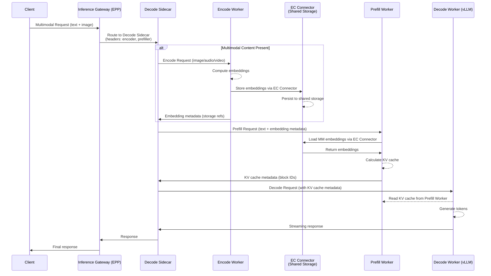
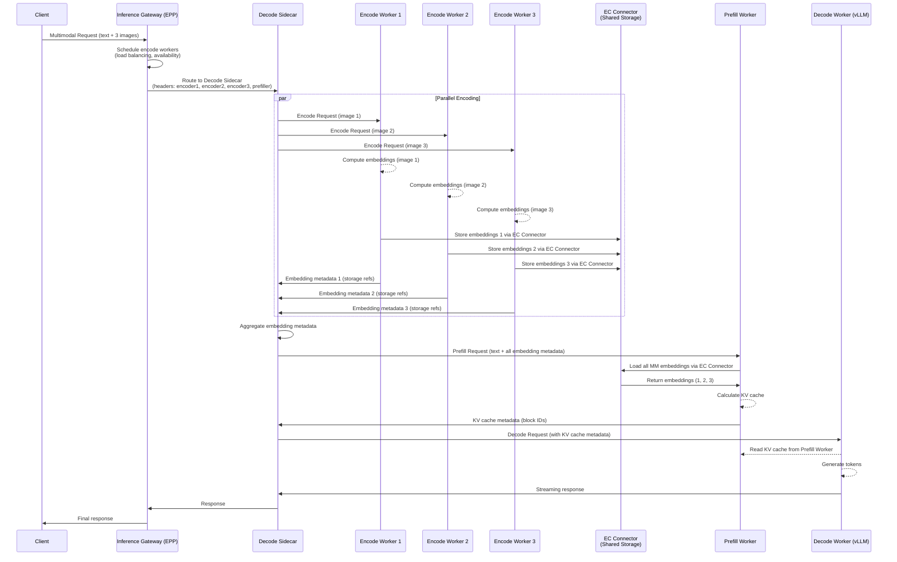

# Proposal: E/P/D (Encode/Prefill/Decode) Disaggregation Support in llm-d

## Motivation

### Current State: P/D Disaggregation
llm-d currently supports **Prefill/Decode (P/D) disaggregation**, which separates:
- **Prefill**: Processing the input prompt to generate KV cache
- **Decode**: Auto-regressive token generation using the cached KV

This architecture improves resource utilization by allowing specialized hardware for each stage (e.g., high-memory pods for prefill, high-compute pods for decode).

### The Need for E/P/D Disaggregation

Modern LLM workloads increasingly involve **multimodal inputs** (images, audio, video) that require:
1. **Encoding**: Converting non-text modalities into embeddings
2. **Prefill**: Processing text tokens and encoded embeddings to build KV cache
3. **Decode**: Generating output tokens

**Key Challenges with Current P/D Architecture:**

1. **Heterogeneous Hardware Requirements**
   - **Encoding** (vision/audio models): Requires specialized accelerators (e.g., NVIDIA GPUs with Tensor Cores for vision transformers)
   - **Prefill**: Memory-intensive, benefits from high-bandwidth memory
   - **Decode**: Compute-intensive, optimized for low-latency token generation

2. **Resource Inefficiency**
   - Multimodal models (e.g., LLaVA, Qwen-VL, GPT-4V) waste resources when encoding runs on the same pod as text processing
   - Vision encoders (CLIP, SigLIP) have different scaling characteristics than LLM backbones

3. **Scalability Bottlenecks**
   - Image/video encoding can be 10-100x slower than text tokenization
   - Batching efficiency differs significantly across stages
   - Current P/D disaggregation cannot isolate encoding overhead

4. **Industry Alignment**
   - **vLLM** is actively developing E/P/D support (see vLLM RFC and experimental branches)
   - **NVIDIA NIM** (Dynamo) supports multimodal disaggregation patterns
   - **Ray Serve** and other frameworks are moving toward finer-grained stage separation

### Benefits of E/P/D Disaggregation

1. **Optimized Resource Allocation**
   - Deploy vision encoders on GPU-rich nodes
   - Use CPU/edge devices for lightweight encoding tasks
   - Scale each stage independently based on workload

2. **Improved Throughput**
   - Parallel encoding of multiple images while prefill/decode continues
   - Better batching strategies per stage
   - Reduced head-of-line blocking
   - **URL-based content handling**: When multimodal content is provided as URLs (e.g., `image_url`):
     - Encode workers can download content in parallel without blocking prefill/decode
     - Dedicated encode pods can be co-located with content sources (CDN, object storage)
     - Network bandwidth for downloads doesn't compete with LLM inference traffic
     - Failed downloads can be retried on different encode workers without affecting decode pods

3. **Cost Efficiency**
   - Right-size hardware for each stage (e.g., cheaper GPUs for encoding)
   - Reduce idle time on expensive decode accelerators
   - Optimize network egress costs by placing encode workers near content sources

4. **Flexibility**
   - Support multiple encoder types (vision, audio, video) without coupling to LLM pods
   - Enable encoder model updates without redeploying LLM workers
   - Handle different content delivery methods (URLs, base64, binary) efficiently

5. **Latency Considerations**
   - **URL downloads add latency**: When content is provided as URLs, additional time is required to:
     - Download images/videos from external sources
     - Validate and preprocess content
     - Handle network failures and retries
   - **Mitigation strategies**:
     - Use encode workers with high-bandwidth network connections
     - Implement aggressive caching of downloaded content
     - Support content pre-fetching for known URLs
     - Parallel downloads for multi-image requests
     - Consider base64-encoded content for latency-sensitive applications

---

## Sidecar Architecture Options

This section compares different architectural approaches for implementing E/P/D disaggregation, with special focus on where to place the orchestration logic and how it affects EP/D (Encode+Prefill combined) deployments.

### Option 1: Extended Decode Sidecar

In this approach, the existing sidecar on the Decode Worker is extended to orchestrate all stages.

**Architecture for E/P/D (3 separate pods):**
```
Request → Decode Sidecar → Encode Worker(s) → Prefill Worker → Decode Worker
          (orchestrates     (parallel)
           E, P, D)
```

**Architecture for EP/D (Encode+Prefill combined):**
```
Request → Decode Sidecar → EP Worker(s) → Decode Worker
          (orchestrates     (encode +
           encoding +        prefill)
           prefill)
```

**How it works for EP/D:**
1. Decode Sidecar parses request, extracts images
2. Distributes images to multiple EP workers (parallel encoding)
3. Each EP worker encodes its assigned image, stores embedding
4. Decode Sidecar collects embedding metadata from all EP workers
5. Decode Sidecar sends text + all metadata to ONE EP worker for prefill
6. That EP worker loads all embeddings and runs prefill
7. Decode Worker receives KV cache and generates tokens

**Pros:**
1. **Single Point of Orchestration**: One sidecar manages the entire request lifecycle
2. **Simpler Deployment**: No need to deploy additional sidecars on EP nodes
3. **Consistent with Current P/D Pattern**: Natural extension of existing architecture
4. **Better End-to-End Visibility**: Single component tracks entire request flow
5. **Reduced Network Hops**: Direct communication path from Decode Sidecar
6. **Easier State Management**: Request context, timeouts, and retries in one place
7. **Lower Operational Complexity**: Single sidecar version to maintain
8. **Optimal for E/P/D**: Works equally well for full 3-stage disaggregation
9. **Lower Latency**: Parallel encoding starts immediately from Decode Sidecar

**Cons:**
1. **Decode Sidecar Complexity**: Sidecar becomes more complex with encoding orchestration logic
2. **Potential Bottleneck**: All requests flow through Decode Sidecar
3. **Resource Usage on Decode Pods**: Decode pods need more CPU/memory for sidecar operations
4. **Coupling**: Decode deployment coupled with encoding logic
5. **Request Parsing Required**: Must parse multimodal requests to extract and distribute images
6. **EP/D Specific**: For EP/D, must coordinate which EP worker does prefill after encoding

---

### Option 2: EP Sidecar for Encoding (EP/D Only)

In this approach, a new sidecar is deployed on EP (Encode+Prefill) Workers to handle encoding orchestration. **This option only applies to EP/D disaggregation.**

**Architecture for EP/D:**
```
Request → Decode Sidecar → EP Sidecar → EP Worker(s) → Decode Worker
          (unchanged)      (orchestrates  (encode +
                            encoding +     prefill)
                            prefill)
```

**How it works:**
1. Decode Sidecar forwards full request to EP Sidecar (unchanged behavior)
2. EP Sidecar parses request, extracts images
3. EP Sidecar distributes images to multiple EP workers (parallel encoding)
4. Each EP worker encodes its assigned image
5. EP Sidecar collects embedding metadata from all EP workers
6. EP Sidecar runs prefill locally with all embeddings
7. Returns KV cache metadata to Decode Worker

**Pros:**
1. **Decode Sidecar Unchanged**: Existing Decode Sidecar code remains untouched - MAJOR benefit
2. **Separation of Concerns**: Encoding logic isolated to EP tier
3. **Better Resource Allocation**: Encoding orchestration overhead on EP pods
4. **Decode Pods Stay Lightweight**: Decode pods focus purely on token generation
5. **Natural Staging**: EP worker is the consumer of embeddings
6. **Independent Scaling**: Can scale EP sidecars independently
7. **Lower Risk**: New functionality in new component, doesn't affect existing P/D deployments
8. **Easier Migration**: Existing deployments can adopt EP/D without touching Decode tier
9. **EP-Optimized**: Sidecar co-located with encoding and prefill operations

**Cons:**
1. **Additional Deployment Complexity**: Need to deploy sidecars on EP tier
2. **More Network Hops**: Decode Sidecar → EP Sidecar → EP Workers (extra hop)
3. **Complex Error Handling**: Failures must propagate through EP Sidecar to Decode Sidecar
4. **State Synchronization**: Both sidecars need to coordinate on request state
5. **Harder Debugging**: Request flow spans multiple components
6. **Version Skew Risk**: Two sidecar versions to keep in sync
7. **EP/D Only**: Doesn't work for full E/P/D disaggregation (3 separate pod types)
8. **Higher Latency**: Extra network hop adds latency vs Option 1

---

### Option 3: Prefill Sidecar for Encoding (E/P/D Only)

In this approach, a new sidecar is deployed on Prefill Workers to handle encoding orchestration. **This option only applies to full E/P/D disaggregation (3 separate pod types).**

**Architecture for E/P/D:**
```
Request → Decode Sidecar → Prefill Sidecar → Encode Worker(s) → Prefill Worker → Decode Worker
          (unchanged)      (orchestrates E)   (parallel)
```

**How it works:**
1. Decode Sidecar forwards full request to Prefill Sidecar
2. Prefill Sidecar parses request, extracts images
3. Prefill Sidecar distributes images to Encode workers (parallel)
4. Encode workers return embedding metadata
5. Prefill Sidecar runs prefill with embeddings
6. Returns KV cache metadata to Decode Worker

**Pros:**
1. **Decode Sidecar Unchanged**: Existing code remains untouched
2. **Separation of Concerns**: Encoding logic isolated to Prefill tier
3. **Natural Staging**: Prefill is the consumer of embeddings
4. **Lower Risk**: New functionality doesn't affect existing P/D deployments
5. **E/P/D Optimized**: Works for full 3-stage disaggregation

**Cons:**
1. **Additional Deployment Complexity**: Need sidecars on both Prefill and Decode tiers
2. **More Network Hops**: Extra hop through Prefill Sidecar
3. **Complex Error Handling**: Multi-component error propagation
4. **E/P/D Only**: Doesn't work for EP/D (combined Encode+Prefill)
5. **Higher Latency**: Extra network hop vs Option 1

---

### Comparison Matrix

| Aspect | Option 1: Decode Sidecar | Option 2: EP Sidecar (EP/D) | Option 3: Prefill Sidecar (E/P/D) |
|--------|-------------------------|----------------------------|----------------------------------|
| **Deployment Complexity** | ✅ Low (single sidecar) | ⚠️ Medium (two sidecars) | ❌ High (two sidecars) |
| **Operational Overhead** | ✅ Low | ⚠️ Medium | ❌ High |
| **Request Latency** | ✅ Lowest (direct) | ⚠️ Medium (+1 hop) | ❌ Higher (+1 hop) |
| **Decode Sidecar Changes** | ❌ Significant | ✅ None | ✅ None |
| **Decode Pod Resources** | ❌ Higher | ✅ Lower | ✅ Lower |
| **Separation of Concerns** | ❌ Lower | ✅ Higher | ✅ Higher |
| **Error Handling** | ✅ Simpler | ⚠️ Medium | ❌ Complex |
| **Debugging/Tracing** | ✅ Easier | ⚠️ Medium | ❌ Harder |
| **Backward Compatibility** | ✅ Natural extension | ✅ No changes to existing | ✅ No changes to existing |
| **Works for E/P/D** | ✅ Yes | ❌ No | ✅ Yes |
| **Works for EP/D** | ✅ Yes | ✅ Yes | ❌ No |
| **Migration Risk** | ⚠️ Medium | ✅ Low | ⚠️ Medium |
| **Code Complexity** | ⚠️ One complex sidecar | ⚠️ Two medium sidecars | ❌ Two complex sidecars |

---

### Recommendations

#### For E/P/D (3 separate pod types): Option 1 (Extended Decode Sidecar)

**Rationale:**

---

### Option 4: EPP-Designated Coordinator (Hybrid Approach)

In this approach, the **EPP scheduler** (not a new component) selects both the Encoder pods and the Prefill/EP pod. The Prefill/EP pod that EPP selects naturally becomes the coordinator, and its sidecar orchestrates the encoding stage. **This works for both E/P/D and EP/D configurations.**

**Key Insight:** EPP already chooses the Prefill pod in the current P/D design. For E/P/D, EPP simply adds encoder selection to its existing logic, and the chosen Prefill pod coordinates them.

**Architecture for E/P/D:**
```
Request → Decode Sidecar → Coordinator Prefill Sidecar → Encode Worker(s) → Prefill Workers → Decode Worker
          (unchanged)      (orchestrates E,              (parallel)         (coordinator
                            coordinates P)                                   + others)
```

**Architecture for EP/D:**
```
Request → Decode Sidecar → Coordinator EP Sidecar → EP Worker(s) → Decode Worker
          (unchanged)      (orchestrates E,         (encode +      
                            runs P locally)          prefill)
```

**How it works:**
1. **EPP Scheduler** (existing component, enhanced):
   - Analyzes request for multimodal content
   - Selects multiple Encode/EP workers for parallel encoding
   - Selects ONE Prefill/EP worker (using existing prefill selection logic)
   - The selected Prefill/EP worker automatically becomes the coordinator
   - Sets headers: `x-encoder-host-ports` (list) and `x-prefiller-host-port` (coordinator)

2. **Decode Sidecar** (unchanged):
   - Forwards full request to the Prefill/EP pod specified in `x-prefiller-host-port`
   - No awareness of encoding coordination

3. **Coordinator Prefill/EP Sidecar** (new logic added):
   - Receives request from Decode Sidecar
   - Checks if `x-encoder-host-ports` header exists
   - If yes, acts as coordinator:
     - Parses request, extracts images
     - Distributes images to other Encode/EP workers (parallel)
     - Encodes its own assigned image locally
     - Collects embedding metadata from all workers
     - Runs prefill locally with all embeddings
   - If no, runs normal prefill (backward compatible)
   - Returns KV cache metadata to Decode Worker

**EPP Header Example:**
```
x-encoder-host-ports: ep1:8000,ep2:8000,ep3:8000
x-prefiller-host-port: ep1:8000  # EPP selected ep1 for prefill, so it's the coordinator
```

**Key Insight:**
- **EPP already selects the Prefill pod** in current P/D design
- For E/P/D, EPP just adds encoder selection to its existing scheduling logic
- The Prefill pod EPP selects naturally becomes the coordinator
- No new "coordinator selection" logic needed - it's the same Prefill selection EPP already does!

**Pros:**
1. **Decode Sidecar Unchanged**: Zero changes to existing Decode Sidecar - MAJOR benefit
2. **EPP-Driven Coordination**: EPP intelligence determines optimal coordinator
3. **Works for Both E/P/D and EP/D**: Unified approach for all configurations
4. **Natural Load Balancing**: EPP can rotate coordinator selection
5. **Optimal Resource Usage**: Coordinator does useful work (encoding + prefill)
6. **Simpler Than Option 2/3**: Single pattern for both E/P/D and EP/D
7. **Lower Risk**: New functionality isolated to Prefill/EP tier
8. **Easier Migration**: Existing deployments unaffected
9. **Coordinator Co-location**: Coordinator has local access to its own embeddings
10. **Flexible Scaling**: Can scale coordinators independently

**Cons:**
1. **Coordinator Sidecar Complexity**: Selected Prefill/EP sidecar becomes more complex
2. **More Network Hops**: Decode → Coordinator → Other Encoders (extra hop)
3. **Coordinator Selection Logic**: EPP must implement coordinator selection
4. **Asymmetric Workers**: Coordinator worker has different responsibilities than others
5. **Coordinator Bottleneck**: If coordinator fails, entire request fails
6. **State Management**: Coordinator must track multiple parallel encoding operations

**Implementation Details:**

**EPP Scheduling Logic (Enhanced):**
```yaml
# EPP's existing prefill selection logic is reused:
1. Analyze request for multimodal content
2. If multimodal:
   a. Select N Encode/EP workers (new: encoder selection)
   b. Select 1 Prefill/EP worker (existing: prefill selection logic)
      - Best prefix cache hit
      - Lowest load
      - Network locality
   c. The selected Prefill/EP worker IS the coordinator (no separate selection)
3. If text-only:
   - Use existing P/D logic (backward compatible)
```

**No New Coordinator Selection Logic Needed:**
- EPP already has sophisticated logic to select the best Prefill pod
- That same pod naturally coordinates encoding
- Reuses existing scheduling intelligence (cache hits, load, locality)

**Coordinator Sidecar Logic:**
```go
func (s *Server) chatCompletionsHandler(w http.ResponseWriter, r *http.Request) {
    encoderHosts := r.Header.Values("x-encoder-host-ports")
    myHost := r.Header.Get("x-prefiller-host-port")
    
    // Am I the coordinator?
    isCoordinator := contains(encoderHosts, myHost)
    
    if isCoordinator && len(encoderHosts) > 1 {
        // Parse request, extract images
        images := parseMultimodalRequest(r)
        
        // Distribute images to other encoders (parallel)
        embeddings := distributeAndCollect(images, encoderHosts, myHost)
        
        // Add my own encoding to embeddings
        myEmbedding := encodeLocally(myImage)
        embeddings = append(embeddings, myEmbedding)
        
        // Run prefill with all embeddings
        runPrefill(r, embeddings)
    } else {
        // Not coordinator, just forward to local vLLM
        s.decoderProxy.ServeHTTP(w, r)
    }
}
```

**Comparison with Other Options:**

| Aspect | Option 4: Coordinator | Option 1: Decode | Option 2: EP | Option 3: Prefill |
|--------|----------------------|------------------|--------------|-------------------|
| **Decode Sidecar Changes** | ✅ None | ❌ Significant | ✅ None | ✅ None |
| **Works for E/P/D** | ✅ Yes | ✅ Yes | ❌ No | ✅ Yes |
| **Works for EP/D** | ✅ Yes | ✅ Yes | ✅ Yes | ❌ No |
| **Operational Complexity** | ⚠️ Medium | ✅ Low | ⚠️ Medium | ❌ High |
| **Request Latency** | ⚠️ Medium (+1 hop) | ✅ Lowest | ⚠️ Medium (+1 hop) | ❌ Higher (+1 hop) |
| **EPP Intelligence** | ✅ High (selects coordinator) | ⚠️ Medium | ⚠️ Medium | ⚠️ Medium |
| **Load Balancing** | ✅ EPP-driven | ⚠️ Manual | ⚠️ Manual | ⚠️ Manual |
| **Migration Risk** | ✅ Low | ⚠️ Medium | ✅ Low | ⚠️ Medium |

---

### Recommendations

#### Primary Recommendation: Option 4 (Unified Coordinator Sidecar)

**Best overall choice for most deployments.**

**Rationale:**
1. **Zero Risk to Decode**: Existing Decode Sidecar completely unchanged
2. **Universal**: Works for both E/P/D and EP/D configurations
3. **EPP-Driven Intelligence**: Leverages EPP's scheduling intelligence for coordinator selection
4. **Natural Load Balancing**: EPP can rotate coordinator selection based on load
5. **Optimal Resource Usage**: Coordinator does useful work (encoding + prefill)
6. **Easier Migration**: Existing P/D deployments unaffected
7. **Flexible**: Can adapt to different deployment patterns

**Trade-offs:**
- One extra network hop vs Option 1 (acceptable for stability benefit)
- Coordinator sidecar more complex (but isolated to Prefill/EP tier)

**When to Use:**
- ✅ Existing P/D deployments migrating to E/P/D or EP/D
- ✅ Risk-averse production environments
- ✅ Need flexibility between E/P/D and EP/D configurations
- ✅ Want EPP-driven intelligent coordination

---

#### Alternative: Option 1 (Extended Decode Sidecar)

**Best for new deployments prioritizing performance.**

**Rationale:**
1. **Lowest Latency**: No extra network hops, parallel encoding starts immediately
2. **Operational Simplicity**: Single sidecar to manage
3. **Natural Evolution**: Extends existing P/D pattern
4. **Industry Alignment**: Most disaggregated systems use single orchestrator

**Trade-offs:**
- Requires changes to Decode Sidecar (higher risk)
- More complex Decode Sidecar code

**When to Use:**
- ✅ New deployments (greenfield)
- ✅ Performance-critical applications
- ✅ Teams comfortable with Decode Sidecar changes
- ✅ Simpler operational model preferred

---

#### Decision Matrix

| Scenario | Recommended Option | Reason |
|----------|-------------------|---------|
| **Existing P/D deployment** | **Option 4** | Zero risk to Decode tier, universal |
| **New deployment** | Option 1 or 4 | Option 1 for performance, Option 4 for flexibility |
| **Performance-critical** | Option 1 | Lowest latency |
| **Risk-averse** | **Option 4** | Decode Sidecar unchanged, isolated changes |
| **EP/D configuration** | **Option 4** or Option 2 | Option 4 preferred for universality |
| **E/P/D configuration** | **Option 4** or Option 1 | Option 4 for safety, Option 1 for performance |
| **Need flexibility** | **Option 4** | Works for both E/P/D and EP/D |
| **Simple operations** | Option 1 | Single sidecar to manage |
| **EPP-driven intelligence** | **Option 4** | Leverages EPP coordinator selection |

**Summary:**
- **Option 4** is recommended for most production deployments, especially existing P/D systems
- **Option 1** is recommended for new deployments where performance is critical and team is comfortable with Decode Sidecar changes
- **Options 2 & 3** are specialized variants that Option 4 supersedes

---

## High-Level Design

### Architecture Overview

```
┌─────────────────────────────────────────────────────────────────┐
│                         Client Request                           │
│                    (Text + Image/Audio/Video)                    │
└────────────────────────────┬────────────────────────────────────┘
                             │
                             ▼
                    ┌────────────────┐
                    │  Envoy Proxy   │
                    └────────┬───────┘
                             │
                             ▼
                    ┌────────────────┐
                    │      EPP       │◄─── Scheduling Decision
                    │  (Scheduler)   │     (Select E, P, D pods)
                    └────────┬───────┘
                             │
                ┌────────────┼────────────┐
                │            │            │
                ▼            ▼            ▼
         ┌──────────┐  ┌──────────┐  ┌──────────┐
         │  Encode  │  │ Prefill  │  │  Decode  │
         │  Worker  │  │  Worker  │  │  Worker  │
         │          │  │          │  │ +Sidecar │
         └────┬─────┘  └────┬─────┘  └────┬─────┘
              │             │             │
              │  Embedding  │  KV Cache   │
              │  Metadata   │  Metadata   │
              └─────────────┴─────────────┘
                            │
                            ▼
                    ┌────────────────┐
                    │    Response    │
                    └────────────────┘
```

### Request Flow

1. **Client Request** → Envoy with multimodal payload (text + image URLs/data)
2. **EPP Scheduling**:
   - Analyzes request (modality types, prompt length, cache hits, number of images)
   - Selects optimal pods for each stage:
     - **Encode Workers** (one or more, if multimodal content present)
       - For single image: select 1 encoder
       - For multiple images: select N encoders for parallel processing
     - **Prefill Worker** (for KV cache generation)
     - **Decode Worker** (for token generation)
   - Returns routing headers:
     - `x-encoder-host-ports`: Comma-separated list of encoder endpoints
     - `x-encoder-image-mapping`: JSON mapping of image index to encoder
     - `x-prefiller-host-port`: Prefill worker endpoint

3. **Execution Flow**:
   - Request lands on **Decode Worker Sidecar**
   - Sidecar orchestrates:
     - **Stage 1 (Encode)**: If `x-encoder-host-ports` exists:
       - **Single Image**: Send to one Encode Worker
       - **Multiple Images**: Send each image to assigned Encode Worker in parallel
       - Wait for all encoding to complete (with timeout)
       - Receive **embedding metadata** from each encoder
       - Aggregate metadata in order
     - **Stage 2 (Prefill)**: If `x-prefiller-host-port` exists:
       - Send text + aggregated embedding metadata to Prefill Worker
       - Prefill Worker loads MM embeddings from shared storage via EC Connector
       - Prefill Worker calculates KV cache
       - Receive KV cache metadata
     - **Stage 3 (Decode)**:
       - Run decode locally with KV cache reference
       - Decode Worker reads KV cache from Prefill Worker's memory
       - Stream tokens back to client

4. **Response** → Decode Sidecar → Envoy → Client

### Sequence Diagram: Single Image



### Sequence Diagram: Multiple Images (Parallel Encoding)

For requests with multiple images, the EPP scheduler selects multiple encode workers and the sidecar orchestrates parallel encoding:



**Key Points for Multi-Image Encoding:**
1. **EPP Scheduling**: Selects N encode workers based on:
   - Number of images in request
   - Encoder load and availability
   - Hardware capabilities
   - Network locality to shared storage

2. **Parallel Execution**: Sidecar sends encoding requests concurrently to all selected workers

3. **EC Connector (Shared Storage)**:
   - Encode Workers store embeddings via EC Connector to shared storage
   - Storage can be: distributed object store, shared memory fabric, NVMe-oF, etc.
   - Prefill Worker loads embeddings via EC Connector in a single batch operation
   - Decouples encoder and prefill workers (no direct memory access needed)

4. **Metadata Aggregation**: Sidecar collects all embedding metadata (storage references) and forwards as a batch to Prefill Worker

5. **Prefill Loads**: Prefill Worker uses EC Connector to load all embeddings efficiently from shared storage

6. **Failure Handling**: If one encoder fails, sidecar can:
   - Retry on another encoder
   - Fall back to sequential encoding
   - Return partial results (if model supports it)

---

## Suggested Changes

### 1. EPP Scheduler Enhancements

#### Enhanced "by-label" Filter

The existing [`by-label` filter](https://github.com/llm-d/llm-d-inference-scheduler/blob/main/docs/disagg_pd.md) will be extended to support additional role values for E/P/D disaggregation. This maintains backward compatibility with existing P/D deployments while enabling new encoding capabilities.

**Extended Role Values for `llm-d.ai/role` Label:**

The `by-label` filter will now accept the following values (in addition to existing P/D values):
  - `encode` or `e`: Encode-only pods (E/P/D disaggregation)
  - `prefill` or `p`: Prefill-only pods (existing P/D)
  - `decode` or `d`: Decode-only pods (existing P/D)
  - `encode-prefill` or `ep`: Combined encode+prefill pods (EP/D disaggregation)
  - `encode-decode` or `ed`: Combined encode+decode pods (E/PD disaggregation - rare)
  - `prefill-decode` or `pd`: Combined prefill+decode pods (existing, backward compatible)
  - `encode-prefill-decode` or `epd`: All-in-one pods (EPD monolithic)
  - `all`: Pods that can handle any stage (maximum flexibility)

**Deployment Configuration Examples:**

1. **Full E/P/D Disaggregation** (3 separate pod types):
```yaml
# Encode pods
labels:
  llm-d.ai/role: encode

# Prefill pods
labels:
  llm-d.ai/role: prefill

# Decode pods
labels:
  llm-d.ai/role: decode
```

2. **EP/D Disaggregation** (encode+prefill combined):
```yaml
# Encode+Prefill pods
labels:
  llm-d.ai/role: encode-prefill

# Decode pods
labels:
  llm-d.ai/role: decode
```

3. **E/PD Disaggregation** (prefill+decode combined):
```yaml
# Encode pods
labels:
  llm-d.ai/role: encode

# Prefill+Decode pods
labels:
  llm-d.ai/role: prefill-decode
```

4. **EPD Monolithic** (all stages in one pod):
```yaml
# All-in-one pods
labels:
  llm-d.ai/role: encode-prefill-decode
  # or
  llm-d.ai/role: all
```

5. **Backward Compatible P/D** (no encoding):
```yaml
# Prefill pods
labels:
  llm-d.ai/role: prefill

# Decode pods
labels:
  llm-d.ai/role: decode
```

**Example Filter Configuration for E/P/D Profiles:**
```yaml
plugins:
  # Encode stage filter (using existing by-label filter)
  - type: by-label
    name: encode-stage-filter
    parameters:
      label: "llm-d.ai/role"
      validValues: ["encode", "encode-prefill", "encode-prefill-decode", "all"]
      allowsNoLabel: false
  
  # Prefill stage filter (using existing by-label filter)
  - type: by-label
    name: prefill-stage-filter
    parameters:
      label: "llm-d.ai/role"
      validValues: ["prefill", "encode-prefill", "prefill-decode", "encode-prefill-decode", "all"]
      allowsNoLabel: true  # Backward compatible with unlabeled pods
  
  # Decode stage filter (using existing by-label filter)
  - type: by-label
    name: decode-stage-filter
    parameters:
      label: "llm-d.ai/role"
      validValues: ["decode", "prefill-decode", "encode-prefill-decode", "all"]
      allowsNoLabel: true  # Backward compatible with unlabeled pods

schedulingProfiles:
  - name: encode
    plugins:
      - pluginRef: encode-stage-filter
      # ... other plugins
  - name: prefill
    plugins:
      - pluginRef: prefill-stage-filter
      # ... other plugins
  - name: decode
    plugins:
      - pluginRef: decode-stage-filter
      # ... other plugins
```

#### New Plugins

In addition to extending the existing `by-label` filter, the following new plugins will be introduced:

**a) Multimodal Decider (`multimodal-epd-decider`)**
```yaml
- type: multimodal-epd-decider
  parameters:
    enableEncoding: true
    minImageSize: 224  # Skip encoding for tiny images
    encoderTimeout: 5000  # ms
```
- Determines if encoding stage is needed
- Checks for presence of image/audio/video in request
- Can skip encoding for cached embeddings

**b) Encode-Aware Scorer (`encode-load-scorer`)**
```yaml
- type: encode-load-scorer
  parameters:
    threshold: 10
    encoderType: "vision"  # vision, audio, video
```
- Scores encode workers based on:
  - Current encoding queue depth
  - Encoder model compatibility
  - Hardware capabilities (GPU memory, compute)

#### Modified Plugins

**PdProfileHandler → EpdProfileHandler**
```yaml
- type: epd-profile-handler
  parameters:
    encodeProfile: "encode"
    prefillProfile: "prefill"
    decodeProfile: "decode"
    deciderPluginName: "multimodal-epd-decider"
    primaryPort: 8000
```
- Extends existing P/D handler to support 3-stage routing
- Backward compatible (encode stage optional)

### 2. Scheduling Profiles

**Example Configuration:**
```yaml
apiVersion: inference.networking.x-k8s.io/v1alpha1
kind: EndpointPickerConfig
featureGates:
- prepareDataPlugins
- epdDisaggregation  # New feature gate
plugins:
  - type: encode-filter
  - type: prefill-filter
  - type: decode-filter
  - type: precise-prefix-cache-scorer
    parameters:
      tokenProcessorConfig:
        blockSize: 64
  - type: encode-load-scorer
  - type: load-aware-scorer
  - type: max-score-picker
  - type: multimodal-epd-decider
    parameters:
      enableEncoding: true
  - type: epd-profile-handler
    parameters:
      deciderPluginName: multimodal-epd-decider
      primaryPort: 8000

schedulingProfiles:
  - name: encode
    plugins:
      - pluginRef: encode-filter
      - pluginRef: max-score-picker
      - pluginRef: encode-load-scorer
        weight: 1
  - name: prefill
    plugins:
      - pluginRef: prefill-filter
      - pluginRef: max-score-picker
      - pluginRef: precise-prefix-cache-scorer
        weight: 2
  - name: decode
    plugins:
      - pluginRef: decode-filter
      - pluginRef: max-score-picker
      - pluginRef: precise-prefix-cache-scorer
        weight: 2
      - pluginRef: load-aware-scorer
        weight: 1
```

### 3. Sidecar Enhancements

**New Responsibilities:**
- Parse multimodal request payloads (OpenAI vision API format)
- Extract images/audio/video from request
- **Parallel Encoding Orchestration**:
  - Distribute images across multiple Encode Workers
  - Send encoding requests concurrently
  - Wait for all encoders to complete (with timeout)
  - Handle partial failures and retries
- Receive and aggregate **embedding metadata** from multiple encoders
- Maintain ordering of embeddings to match image positions
- Coordinate memory references between stages
- Handle encoding failures and retries

**API Extensions:**
```go
type MultimodalRequest struct {
    Text     string
    Images   []ImageInput
    Audio    []AudioInput
    Video    []VideoInput
}

type EncodingRequest struct {
    ImageIndex int        // Position in original request
    ImageData  ImageInput
    RequestID  string     // For tracking
}

type EncodingResponse struct {
    ImageIndex    int                  // Position in original request
    EmbeddingRefs []EmbeddingReference // Metadata about where embeddings are stored
    Metadata      EncodingMetadata
}

type EmbeddingReference struct {
    TensorID     string  // Unique identifier for the embedding tensor
    EncoderHost  string  // Host where embeddings are stored
    MemoryBlocks []int   // Memory block IDs on Encode Worker
    Shape        []int   // Tensor dimensions
    Dtype        string  // Data type (float16, bfloat16, etc.)
}

type AggregatedEmbeddings struct {
    Embeddings []EncodingResponse // Ordered by ImageIndex
    TotalCount int
}
```

### 4. Worker Labeling

**Encode Workers:**
```yaml
metadata:
  labels:
    llm-d.ai/role: encode
    llm-d.ai/encoder-type: vision  # or audio, video
    llm-d.ai/encoder-model: clip-vit-large
```

**Prefill Workers:**
```yaml
metadata:
  labels:
    llm-d.ai/role: prefill
```

**Decode Workers:**
```yaml
metadata:
  labels:
    llm-d.ai/role: decode
```

**Hybrid Workers (backward compatibility):**
```yaml
metadata:
  labels:
    llm-d.ai/role: both  # Can handle all stages
```

### 5. Protocol Extensions

**HTTP Headers:**
- `x-encoder-host-ports`: Comma-separated list of encoder endpoints (e.g., `10.0.1.5:8000,10.0.1.6:8000`)
- `x-encoder-image-mapping`: JSON mapping of image index to encoder (e.g., `{"0":"10.0.1.5:8000","1":"10.0.1.6:8000"}`)
- `x-encoder-model`: Encoder model identifier (e.g., `clip-vit-large-patch14`)
- `x-embedding-refs`: JSON-encoded array of embedding metadata (tensor IDs, memory blocks)
- `x-prefiller-host-port`: Prefill worker endpoint (existing)
- `x-encoding-cache-key`: Optional cache key for embedding metadata

**Request Format (OpenAI-compatible):**
```json
{
  "model": "llava-v1.6-34b",
  "messages": [
    {
      "role": "user",
      "content": [
        {"type": "text", "text": "What's in this image?"},
        {"type": "image_url", "image_url": {"url": "https://..."}}
      ]
    }
  ]
}
```

### 6. Metrics and Observability

**New Metrics:**
- `llmd_encode_requests_total`: Total encoding requests
- `llmd_encode_duration_seconds`: Encoding latency histogram
- `llmd_encode_queue_depth`: Current encoding queue size
- `llmd_encode_parallel_workers`: Number of encoders used per request
- `llmd_encode_images_per_request`: Distribution of image counts
- `llmd_epd_requests_total{stage="encode|prefill|decode"}`: Per-stage request counts
- `llmd_epd_stage_selection{decision="local|remote"}`: Stage routing decisions
- `llmd_encode_failures_total{reason="timeout|error|retry"}`: Encoding failure tracking

### 7. vLLM Integration

**Encode Worker (vLLM):**
- Run vLLM with `--enable-encoder-only` flag (when available)
- Expose encoding endpoint: `POST /v1/encode`
- Store embeddings in GPU memory
- Return **embedding metadata** (memory block IDs, tensor references)
- Support remote memory reads via RPC/RDMA

**Prefill Worker (vLLM):**
- Accept embedding metadata via `embedding_refs` parameter
- Read embeddings directly from Encode Worker's memory (zero-copy when possible)
- Process combined text + embeddings
- Return KV cache metadata

**Decode Worker (vLLM):**
- Standard decode with KV cache reference
- Read KV cache from Prefill Worker's memory
- No changes needed (handled by sidecar)

---

## Implementation Phases

### Phase 1: Foundation (Weeks 1-3)
- [ ] Extend existing `by-label` filter to support new E/P/D role values
- [ ] Implement `multimodal-epd-decider` plugin
- [ ] Implement `encode-load-scorer` plugin
- [ ] Extend `PdProfileHandler` → `EpdProfileHandler`
- [ ] Add E/P/D scheduling profile support
- [ ] Update configuration schema

### Phase 2: Sidecar & Protocol (Weeks 4-6)
- [ ] Enhance sidecar to parse multimodal requests
- [ ] Implement encoding request/response handling
- [ ] Add HTTP header support (`x-encoder-host-port`, `x-embedding-refs`)
- [ ] Implement embedding metadata forwarding logic
- [ ] Add retry and timeout handling
- [ ] Support remote memory read coordination

### Phase 3: Worker Integration (Weeks 7-9)
- [ ] Create encode worker deployment templates
- [ ] Integrate with vLLM encoding API
- [ ] Implement embedding storage and memory management
- [ ] Test remote memory reads (RPC/RDMA)
- [ ] Test with CLIP, SigLIP encoders
- [ ] Validate embedding metadata format
- [ ] Performance benchmarking (zero-copy vs. transfer)

### Phase 4: Advanced Features (Weeks 10-12)
- [ ] Implement `encode-load-scorer`
- [ ] Add embedding metadata caching support
- [ ] Implement encoder model routing
- [ ] Add support for audio/video encoders
- [ ] Optimize memory transfer protocols
- [ ] Comprehensive E2E testing

### Phase 5: Production Readiness (Weeks 13-14)
- [ ] Documentation and examples
- [ ] Performance tuning
- [ ] Failure mode testing
- [ ] Migration guide from P/D to E/P/D
- [ ] Release and community feedback

---

## Backward Compatibility

1. **Existing P/D Deployments**: Continue to work unchanged
   - E/P/D is opt-in via feature gate
   - `PdProfileHandler` remains supported

2. **Text-Only Requests**: Automatically skip encoding stage
   - No performance impact
   - Routing falls back to P/D or single-node

3. **Hybrid Workers**: Support `llm-d.ai/role: both`
   - Can handle all stages locally
   - Useful for small deployments

---

## Testing Strategy

### Unit Tests
- Plugin logic (filters, scorers, deciders)
- Sidecar encoding request handling
- Embedding merging and validation

### Integration Tests
- E/P/D routing with mock workers
- Multimodal request parsing
- Error handling and retries

### E2E Tests
- Full E/P/D pipeline with vLLM
- LLaVA, Qwen-VL model testing
- Performance benchmarks vs. P/D
- Failure scenarios (encoder timeout, OOM)

### Performance Tests
- Latency: E/P/D vs. P/D vs. single-node
- Throughput: Requests/second with multimodal workloads
- Resource utilization: GPU/memory per stage

---

## Risks and Mitigations

| Risk | Impact | Mitigation |
|------|--------|------------|
| Increased TTFT (Time to First Token) | High | Optimize encoding parallelism, add caching |
| Encoding worker failures | High | Implement retries, fallback to local encoding |
| Complexity in debugging | Medium | Enhanced logging, distributed tracing |
| vLLM API instability | Medium | Abstract encoding interface, support multiple backends |
| Memory transfer overhead | Medium | Use zero-copy techniques (RDMA, GPU Direct), optimize metadata size |
| Embedding metadata loss | Medium | Implement metadata persistence, retry logic |

---

## Success Metrics

1. **Performance**
   - E/P/D latency ≤ 1.2x P/D latency for multimodal requests
   - 30% reduction in GPU memory usage on decode workers
   - 2x throughput improvement for vision-heavy workloads

2. **Adoption**
   - Support for 3+ multimodal models (LLaVA, Qwen-VL, GPT-4V-compatible)
   - 5+ community deployments within 3 months
   - Positive feedback from early adopters

3. **Reliability**
   - 99.9% success rate for E/P/D routing
   - <1% increase in error rate vs. P/D
   - Graceful degradation on encoder failures

---

## References

1. **vLLM E/P/D Support**
   - [vLLM RFC: Disaggregated Serving](https://github.com/vllm-project/vllm/issues/xyz) (check latest RFCs)
   - [vLLM Multimodal Documentation](https://docs.vllm.ai/en/latest/models/multimodal.html)

2. **NVIDIA NIM (Dynamo)**
   - [Multimodality Support Guide](https://docs.nvidia.com/dynamo/user-guides/multimodality-support)
   - [Disaggregated Inference Patterns](https://docs.nvidia.com/nim/inference-microservices/latest/)

3. **Industry Patterns**
   - [Ray Serve Multi-Stage Pipelines](https://docs.ray.io/en/latest/serve/tutorials/multi-stage-pipeline.html)
   - [Triton Inference Server Ensembles](https://github.com/triton-inference-server/server/blob/main/docs/user_guide/architecture.md#ensemble-models)

4. **Multimodal Models**
   - [LLaVA: Large Language and Vision Assistant](https://llava-vl.github.io/)
   - [Qwen-VL: A Versatile Vision-Language Model](https://github.com/QwenLM/Qwen-VL)
   - [CLIP: Connecting Text and Images](https://github.com/openai/CLIP)

5. **llm-d Documentation**
   - [Current P/D Architecture](./disagg_pd.md)
   - [Architecture Overview](./architecture.md)
   - [Plugin Development Guide](./create_new_filter.md)

---

## Appendix: Example Deployment

**Encode Worker (CLIP):**
```yaml
apiVersion: apps/v1
kind: Deployment
metadata:
  name: clip-encoder
spec:
  replicas: 2
  template:
    metadata:
      labels:
        llm-d.ai/role: encode
        llm-d.ai/encoder-type: vision
        llm-d.ai/encoder-model: clip-vit-large
    spec:
      containers:
      - name: vllm
        image: vllm/vllm-openai:latest
        args:
          - --model=openai/clip-vit-large-patch14
          - --enable-encoder-only
          - --port=8000
        resources:
          limits:
            nvidia.com/gpu: 1
```

**Prefill Worker:**
```yaml
apiVersion: apps/v1
kind: Deployment
metadata:
  name: llava-prefill
spec:
  replicas: 3
  template:
    metadata:
      labels:
        llm-d.ai/role: prefill
    spec:
      containers:
      - name: vllm
        image: vllm/vllm-openai:latest
        args:
          - --model=llava-hf/llava-v1.6-34b-hf
          - --enable-prefix-caching
          - --port=8000
        resources:
          limits:
            nvidia.com/gpu: 2
```

**Decode Worker:**
```yaml
apiVersion: apps/v1
kind: Deployment
metadata:
  name: llava-decode
spec:
  replicas: 5
  template:
    metadata:
      labels:
        llm-d.ai/role: decode
    spec:
      containers:
      - name: sidecar
        image: llm-d/pd-sidecar:latest
        ports:
        - containerPort: 8080
      - name: vllm
        image: vllm/vllm-openai:latest
        args:
          - --model=llava-hf/llava-v1.6-34b-hf
          - --enable-prefix-caching
          - --port=8000
        resources:
          limits:
            nvidia.com/gpu: 2
```

---

**Document Version:** 1.0  
**Last Updated:** 2026-02-12  
**Authors:** llm-d Team  
**Status:** Proposal (RFC)