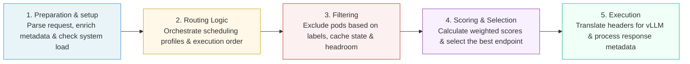

# Plugins

### Overview
This directory contains all built-in plugins for the llm-d-inferece-scheduler.

### Available plugins

The available plugins are grouped into five core categories based on their role within the request processing pipeline, as outlined below. For more detailed information, please refer to the README files located alongside each plugin's source code.

#### 1. Preparation & Setup

- **[Data Layer](datalayer/)**: Runs continuously in the background to monitor the health and stats of all the pods (servers) so the system knows what's available.
  - **Default:** `metrics-data-source` + `core-metrics-extractor`
  - **Interface:** `DataSource` · `Extractor`
  - **Reference**: [datalayer/source/](datalayer/source/), [datalayer/extractor/](datalayer/extractor/)

- **[Parsers](requesthandling/parsers/) & [Producers](requestcontrol/dataproducer/)**: Parsers inspect incoming HTTP and gRPC request payloads to extract the model name and prompt. Producers enrich the request cycle state with additional metadata (e.g., token counts, prefix hashes, latency predictions) consumed by downstream scheduling plugins like scorers and admitters.
  - **Default:** `openai-parser`
  - **Interface:** `Parser` · `DataProducer`
  - **Reference**: [requesthandling/parsers/](requesthandling/parsers/), [requestcontrol/dataproducer/](requestcontrol/dataproducer/)

- **[Flow Control](flowcontrol/) & [Admitters](requestcontrol/admitter/)**: Admitters act as the first line of defense, rejecting requests upfront if the endpoints cannot meet SLOs. Once a request enters the queue, flow control takes over to manage dispatching. It prevents system saturation by enforcing priority bands, per-flow fairness, FCFS ordering, and strict usage limits.
  - **Default:** `utilization-detector` + `fcfs-ordering-policy` + `global-strict-fairness-policy` + `static-usage-limit-policy` 
  - **Interface:** `Admitter` · `SaturationDetector` · `FairnessPolicy` · `OrderingPolicy` · `UsageLimitPolicy`
  - **Reference**: [flowcontrol/](flowcontrol/), [requestcontrol/admitter/](requestcontrol/admitter/)

#### 2. Routing Logic

- **[Profile Handlers & Deciders](scheduling/profilehandler/)**: Orchestrates the selection and execution order of scheduling profiles. Every configuration must include exactly one handler.
  - **Default:** `single-profile-handler`
  - **Interface:** `ProfileHandler`]
  - **Reference**: [scheduling/profilehandler/](scheduling/profilehandler/)

#### 3. Filtering

- **[Filters](scheduling/filter/)**: Excludes pods based on labels, label selectors, specific pod roles, prefix cache state, or SLO headroom.
  - **Interface:** `Filter`
  - **Reference**: [scheduling/filter/bylabel/](scheduling/filter/bylabel/), [scheduling/filter/prefixcacheaffinity/](scheduling/filter/prefixcacheaffinity/), [scheduling/filter/sloheadroomtier/](scheduling/filter/sloheadroomtier/)

#### 4. Scoring & Selection

- **[Scorers](scheduling/scorer/)**: Scores pods using metrics such as [KV-cache prefix matching](scheduling/scorer/preciseprefixcache/), [session affinity](scheduling/scorer/sessionaffinity/), [current load](scheduling/scorer/loadaware/), and [active request counts](scheduling/scorer/activerequest/). Each scorer returns a value in `[0, 1]` per pod; that value is multiplied by the scorer's `weight` (set in `schedulingProfiles`) and accumulated across all scorers into a final score per pod. The pod with the highest total is selected. Weight controls each scorer's relative influence — omitting it defaults to `0`, meaning the scorer has no effect.
  - **Interface:** `Scorer`
  - **Reference**: [scheduling/scorer/](scheduling/scorer/)

- **[Pickers](scheduling/picker/)**: Select one or more candidate endpoints from the scored set for the final routing decision.
  - **Default:** `max-score-picker`
  - **Interface:** `Picker`
  - **Reference**: [scheduling/picker/](scheduling/picker/)

#### 5. Execution & Delivery

- **[PreRequest Plugins](scheduling/profilehandler/disagg/)**: Run after scheduling and before the request is forwarded. Translate scheduling results into HTTP headers consumed by the vLLM sidecar.
  - **Interface:** `PreRequest`
  - **Reference**: [scheduling/profilehandler/](scheduling/profilehandler/)

- **[Response Processing](requestcontrol/requestattributereporter/)**: Adds logging and metadata to the final generated text before handing it back to the user.
  - **Interface:** `ResponseHeaderProcessor` · `ResponseBodyProcessor`
  - **Reference**: [requestcontrol/requestattributereporter/](requestcontrol/requestattributereporter/)

## Related Documentation

- [Architecture Overview](../../../../docs/architecture.md)
